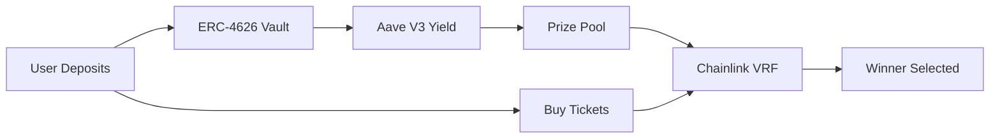

# 🎰 NoCap Lottery - No-Loss DeFi Lottery Protocol

> **Winner takes the yield, everyone keeps their principal**

Revolutionary no-loss lottery where deposits generate Aave V3 yield. Winners claim accumulated interest, everyone withdraws principal anytime. Zero risk, pure upside.

## 🔄 How It Works



**1. Deposit** → Assets locked in ERC-4626 vault earning Aave V3 yield  
**2. Buy Tickets** → Enter lottery rounds with deposits  
**3. Draw Winner** → Chainlink VRF ensures provably fair random selection  
**4. Claim** → Winners get yield, everyone withdraws principal anytime

## 📝 Deployed Contracts (Sepolia Testnet)

| Contract | Address |
|----------|---------|
| **USDC Token** | `0x94a9D9AC8a22534E3FaCa9F4e7F2E2cf85d5E4C8` |
| **USDC Vault (ERC-4626)** | `0x04D925bc53D43Ba105f793cbc30ffc6C3b43fd6D` |
| **USDC Lottery Pool** | `0xA011DcFA5A52bd8497CFEDc1f5f79f3BD479DDc1` |
| **Demo Pool (USDC)** | `0x6FD6D67bF919685CDD352A101AdAEbDB3afb8825` |
| **Demo Pool (ETH)** | `0x4676458a26A89B900FdB1d9EF4E9a039BC3c6f18` |

**Test USDC Faucet:** [Sepolia USDC on Aave Faucet](https://staging.aave.com/faucet/)

## 🚀 Features

- ✅ **USDC Vault Integration** - ERC-4626 compliant vault with Aave V3 yield generation
- ✅ **Frontend Interface** - Modern React UI with RainbowKit wallet connection
- ✅ **Cross-Chain Bridge** - LiFi SDK integration for multi-chain deposits
- 🔄 **Multi-Asset Support** - DAI, USDT, ETH, WBTC vaults (coming soon)
- 🔄 **Lottery Mechanism** - Chainlink VRF for provably fair randomness

## 🛠️ Tech Stack

**Smart Contracts:** Solidity • OpenZeppelin • Aave V3 • Chainlink VRF  
**Frontend:** React • Vite • Wagmi v2 • Viem • RainbowKit • LiFi SDK  
**Infrastructure:** Sepolia Testnet

## 📦 Quick Start

```bash
cd frontend
npm install
npm run dev
```

**App:** `http://localhost:5173`

## 🏆 Sponsor Integrations

- **Yellow Network** - Session-based batched transactions for gas-free multi-ticket purchases
- **ENS** - Human-readable addresses across winner boards and leaderboards
- **LI.FI** - Cross-chain bridging for seamless multi-chain lottery deposits

This project demonstrates real DeFi composability, ERC-4626 standards, modern Web3 frontend, cross-chain capabilities, and innovative no-loss mechanism.

## 📄 License

MIT
